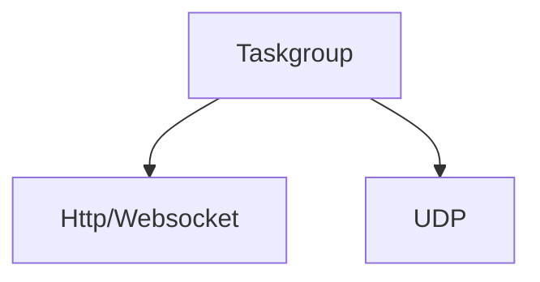
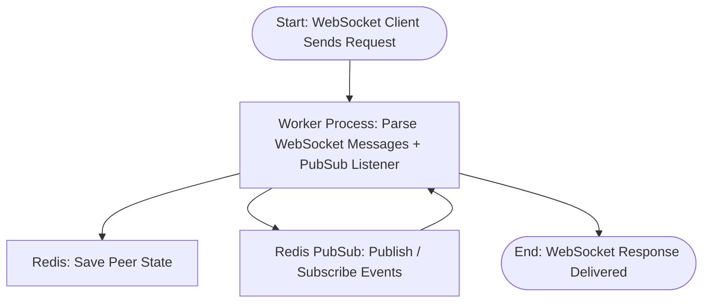
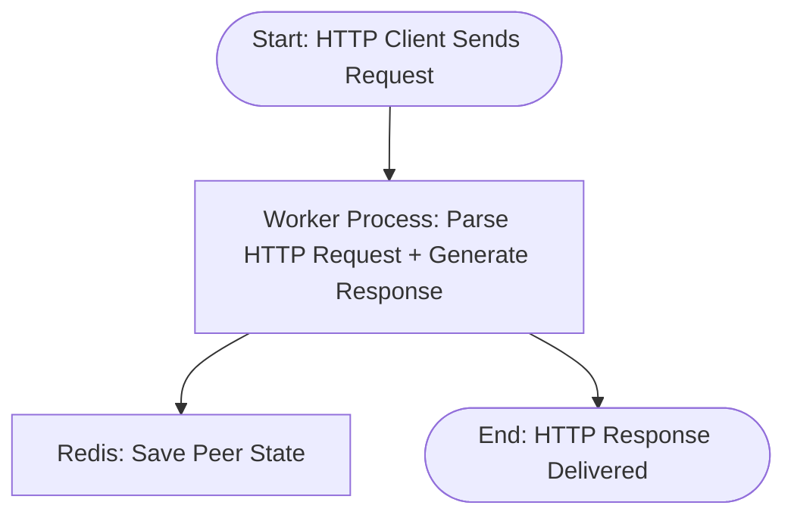
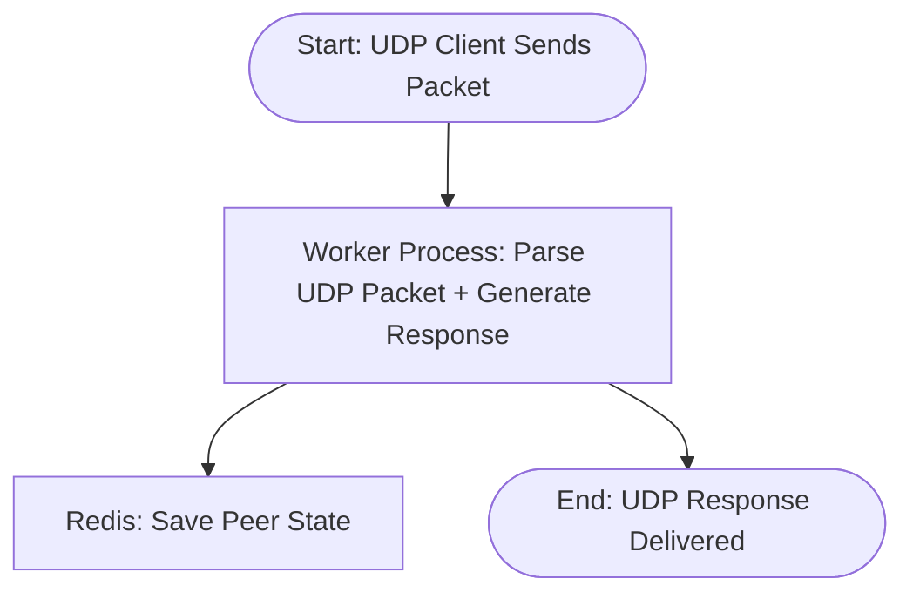

Current architecture is based on **Distributed Event-Driven Masterless Async Architecture with Redis as Event Bus + State Store**


---


## Main Workflow

Flowchart looks like this:

<div class='light' align="center">

    ```mermaid
    flowchart TD
        %% Start
        Start([Start: Client Sends Request])
        style Start fill:#a5d6a7,stroke:#000,font-family:sans-serif  %% even lighter green

        %% Clients
        A[WebSocket Client]
        B[HTTP Client]
        C[UDP Client]
        style A fill:#64b5f6,stroke:#000,font-family:sans-serif  %% lighter blue
        style B fill:#64b5f6,stroke:#000,font-family:sans-serif
        style C fill:#64b5f6,stroke:#000,font-family:sans-serif

        %% Worker Processes
        W1[Worker Process 1]
        W2[Worker Process 2]
        W3[Worker Process 3]
        style W1 fill:#b1ddb4,stroke:#000,font-family:sans-serif
        style W2 fill:#b1ddb4,stroke:#000,font-family:sans-serif
        style W3 fill:#b1ddb4,stroke:#000,font-family:sans-serif

        %% Redis
        RState[Redis: Peer State / Swarm Info]
        RPubSub[Redis: PubSub Event Bus]
        style RState fill:#F5B378,stroke:#000,font-family:sans-serif
        style RPubSub fill:#F5B378,stroke:#000,font-family:sans-serif

        %% End nodes (lighter purple)
        EndWS([WebSocket Response Delivered])
        EndHTTP([HTTP Response Delivered])
        EndUDP([UDP Response Delivered])
        style EndWS fill:#b39ddb,stroke:#000,font-family:sans-serif
        style EndHTTP fill:#b39ddb,stroke:#000,font-family:sans-serif
        style EndUDP fill:#b39ddb,stroke:#000,font-family:sans-serif

        %% Flow connections
        Start --> A
        Start --> B
        Start --> C

        A -->|announce / offer / answer| W1
        B -->|announce / scrape| W2
        C -->|announce / scrape| W3

        W1 -->|Parse messages + PubSub listener| W1
        W2 -->|Parse and respond| W2
        W3 -->|Parse and respond| W3

        W1 -->|Save peer state| RState
        W2 -->|Save peer state| RState
        W3 -->|Save peer state| RState

        W1 -->|Publish events: announce / offer / answer| RPubSub
        W2 -->|Publish events: announce| RPubSub
        W3 -->|Publish events: announce| RPubSub

        RPubSub -->|"peer-peer_id message"| W1
        RPubSub -->|"peer-peer_id message"| W2
        RPubSub -->|"peer-peer_id message"| W3

        W1 -->|send_json to WebSocket client| EndWS
        W2 -->|send bencoded HTTP response| EndHTTP
        W3 -->|send UDP packet| EndUDP

    ```

</div>

<div class='dark' align="center">

    ```mermaid
    flowchart TD
        %% Style Definitions for Dark Background
        classDef client fill:#1f3b6f,stroke:#ffffff,stroke-width:1px,color:#ffffff
        classDef worker fill:#2e7d32,stroke:#ffffff,stroke-width:1px,color:#ffffff
        classDef redis fill:#b35900,stroke:#ffffff,stroke-width:1px,color:#ffffff
        classDef endnode fill:#6a1b9a,stroke:#ffffff,stroke-width:1px,color:#ffffff
        classDef start fill:#004d40,stroke:#ffffff,stroke-width:1px,color:#ffffff

        %% Start
        Start([Start: Client Sends Request])
        class Start start

        %% Clients
        A[WebSocket Client]
        B[HTTP Client]
        C[UDP Client]
        class A,B,C client

        %% Worker Processes
        W1[Worker Process 1]
        W2[Worker Process 2]
        W3[Worker Process 3]
        class W1,W2,W3 worker

        %% Redis
        RState[Redis: Peer State / Swarm Info]
        RPubSub[Redis: PubSub Event Bus]
        class RState,RPubSub redis

        %% End nodes
        EndWS([WebSocket Response Delivered])
        EndHTTP([HTTP Response Delivered])
        EndUDP([UDP Response Delivered])
        class EndWS,EndHTTP,EndUDP endnode

        %% Flow connections
        Start --> A
        Start --> B
        Start --> C

        %% Client -> Worker
        A -->|announce / offer / answer| W1
        B -->|announce / scrape| W2
        C -->|announce / scrape| W3

        %% Worker internal tasks
        W1 -->|Parse messages + PubSub listener| W1
        W2 -->|Parse and respond| W2
        W3 -->|Parse and respond| W3

        %% Worker -> Redis
        W1 -->|Save peer state| RState
        W2 -->|Save peer state| RState
        W3 -->|Save peer state| RState

        W1 -->|Publish events: announce / offer / answer| RPubSub
        W2 -->|Publish events: announce| RPubSub
        W3 -->|Publish events: announce| RPubSub

        %% Redis -> Worker subscriptions
        RPubSub -->|"peer-peer_id message"| W1
        RPubSub -->|"peer-peer_id message"| W2
        RPubSub -->|"peer-peer_id message"| W3

        %% Worker -> Client Responses (separate ends)
        W1 -->|send_json to WebSocket client| EndWS
        W2 -->|send bencoded HTTP response| EndHTTP
        W3 -->|send UDP packet| EndUDP

    ```

</div>


---

## Process Flowchart

Our python process is based on [anyio](https://anyio.readthedocs.io/en/stable/) [task group](https://anyio.readthedocs.io/en/stable/tasks.html):

<center>


</center>

---


## Sub Flowcharts


### Websocket

Our websocket workflow look like this:

<center>



</center>

### HTTP

Our HTTP Flowchart look like this:

<center>



</center>

### UDP

Our UDP Flowchart look like this

<center>



</center>