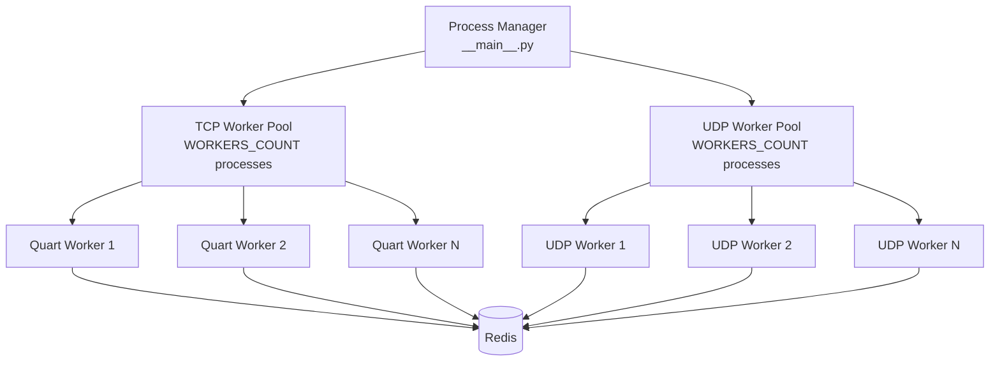
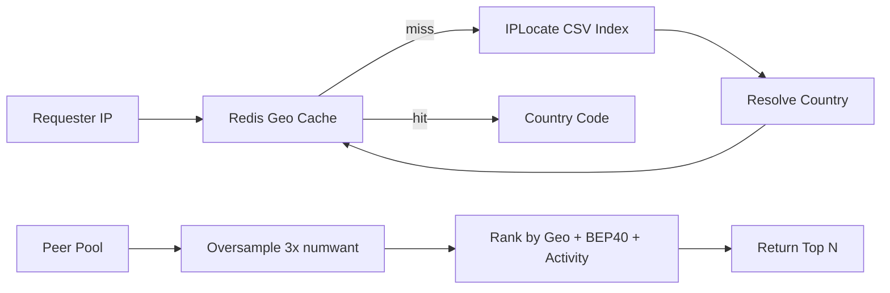
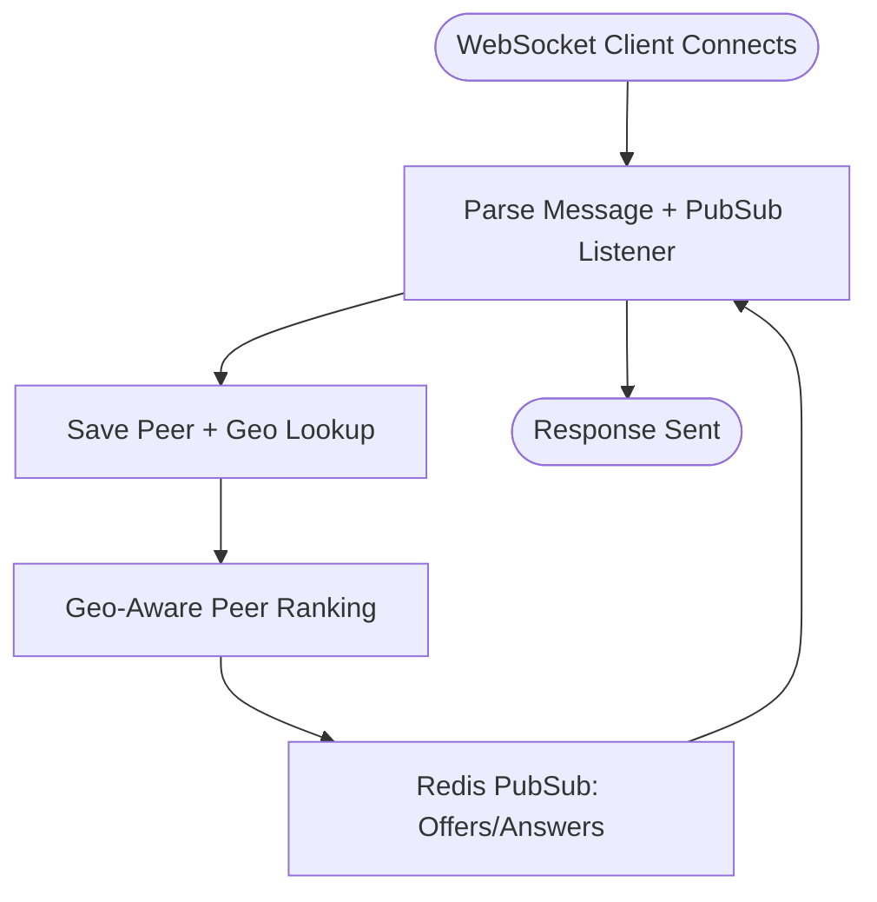
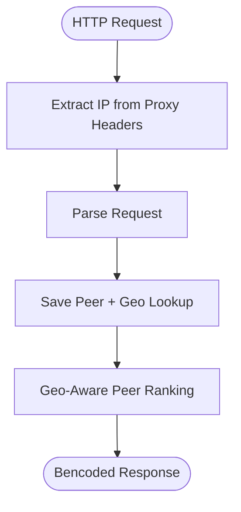
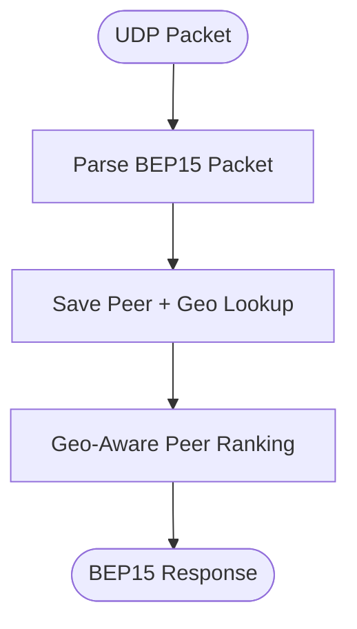

Current architecture is based on **Distributed Event-Driven Masterless Async Architecture with Redis as Event Bus + State Store**


---


## Main Workflow

Flowchart looks like this:

<div class='light' align="center">

    ```mermaid
    flowchart TD
        %% Start
        Start([Start: Client Sends Request])
        style Start fill:#a5d6a7,stroke:#000,font-family:sans-serif  %% even lighter green

        %% Clients
        A[WebSocket Client]
        B[HTTP Client]
        C[UDP Client]
        style A fill:#64b5f6,stroke:#000,font-family:sans-serif  %% lighter blue
        style B fill:#64b5f6,stroke:#000,font-family:sans-serif
        style C fill:#64b5f6,stroke:#000,font-family:sans-serif

        %% Worker Processes
        W1[Worker Process 1]
        W2[Worker Process 2]
        W3[Worker Process 3]
        style W1 fill:#b1ddb4,stroke:#000,font-family:sans-serif
        style W2 fill:#b1ddb4,stroke:#000,font-family:sans-serif
        style W3 fill:#b1ddb4,stroke:#000,font-family:sans-serif

        %% Redis
        RState[Redis: Peer State / Swarm Info]
        RPubSub[Redis: PubSub Event Bus]
        style RState fill:#F5B378,stroke:#000,font-family:sans-serif
        style RPubSub fill:#F5B378,stroke:#000,font-family:sans-serif

        %% End nodes (lighter purple)
        EndWS([WebSocket Response Delivered])
        EndHTTP([HTTP Response Delivered])
        EndUDP([UDP Response Delivered])
        style EndWS fill:#b39ddb,stroke:#000,font-family:sans-serif
        style EndHTTP fill:#b39ddb,stroke:#000,font-family:sans-serif
        style EndUDP fill:#b39ddb,stroke:#000,font-family:sans-serif

        %% Flow connections
        Start --> A
        Start --> B
        Start --> C

        A -->|announce / offer / answer| W1
        B -->|announce / scrape| W2
        C -->|announce / scrape| W3

        W1 -->|Parse messages + PubSub listener| W1
        W2 -->|Parse and respond| W2
        W3 -->|Parse and respond| W3

        W1 -->|Save peer state| RState
        W2 -->|Save peer state| RState
        W3 -->|Save peer state| RState

        W1 -->|Publish events: announce / offer / answer| RPubSub
        W2 -->|Publish events: announce| RPubSub
        W3 -->|Publish events: announce| RPubSub

        RPubSub -->|"peer-peer_id message"| W1
        RPubSub -->|"peer-peer_id message"| W2
        RPubSub -->|"peer-peer_id message"| W3

        W1 -->|send_json to WebSocket client| EndWS
        W2 -->|send bencoded HTTP response| EndHTTP
        W3 -->|send UDP packet| EndUDP

    ```

</div>

<div class='dark' align="center">

    ```mermaid
    flowchart TD
        %% Style Definitions for Dark Background
        classDef client fill:#1f3b6f,stroke:#ffffff,stroke-width:1px,color:#ffffff
        classDef worker fill:#2e7d32,stroke:#ffffff,stroke-width:1px,color:#ffffff
        classDef redis fill:#b35900,stroke:#ffffff,stroke-width:1px,color:#ffffff
        classDef endnode fill:#6a1b9a,stroke:#ffffff,stroke-width:1px,color:#ffffff
        classDef start fill:#004d40,stroke:#ffffff,stroke-width:1px,color:#ffffff

        %% Start
        Start([Start: Client Sends Request])
        class Start start

        %% Clients
        A[WebSocket Client]
        B[HTTP Client]
        C[UDP Client]
        class A,B,C client

        %% Worker Processes
        W1[Worker Process 1]
        W2[Worker Process 2]
        W3[Worker Process 3]
        class W1,W2,W3 worker

        %% Redis
        RState[Redis: Peer State / Swarm Info]
        RPubSub[Redis: PubSub Event Bus]
        class RState,RPubSub redis

        %% End nodes
        EndWS([WebSocket Response Delivered])
        EndHTTP([HTTP Response Delivered])
        EndUDP([UDP Response Delivered])
        class EndWS,EndHTTP,EndUDP endnode

        %% Flow connections
        Start --> A
        Start --> B
        Start --> C

        %% Client -> Worker
        A -->|announce / offer / answer| W1
        B -->|announce / scrape| W2
        C -->|announce / scrape| W3

        %% Worker internal tasks
        W1 -->|Parse messages + PubSub listener| W1
        W2 -->|Parse and respond| W2
        W3 -->|Parse and respond| W3

        %% Worker -> Redis
        W1 -->|Save peer state| RState
        W2 -->|Save peer state| RState
        W3 -->|Save peer state| RState

        W1 -->|Publish events: announce / offer / answer| RPubSub
        W2 -->|Publish events: announce| RPubSub
        W3 -->|Publish events: announce| RPubSub

        %% Redis -> Worker subscriptions
        RPubSub -->|"peer-peer_id message"| W1
        RPubSub -->|"peer-peer_id message"| W2
        RPubSub -->|"peer-peer_id message"| W3

        %% Worker -> Client Responses (separate ends)
        W1 -->|send_json to WebSocket client| EndWS
        W2 -->|send bencoded HTTP response| EndHTTP
        W3 -->|send UDP packet| EndUDP

    ```

</div>


---

## Multi-Core Worker Architecture

Each worker process runs its own **anyio** event loop on a dedicated CPU core:

<center>

```mermaid
flowchart TD
    PM[Process Manager<br/>__main__.py]
    TCP[TCP Worker Pool<br/>WORKERS_COUNT processes]
    UDP[UDP Worker Pool<br/>WORKERS_COUNT processes]

    T1[Quart Worker 1]
    T2[Quart Worker 2]
    Tn[Quart Worker N]

    U1[UDP Worker 1]
    U2[UDP Worker 2]
    Un[UDP Worker N]

    PM --> TCP
    PM --> UDP
    TCP --> T1 & T2 & Tn
    UDP --> U1 & U2 & Un

    Redis[(Redis)]
    T1 & T2 & Tn --> Redis
    U1 & U2 & Un --> Redis
```
</center>

- **TCP Workers**: Handle HTTP + WebSocket via Quart/Hypercorn with `SO_REUSEPORT`
- **UDP Workers**: Handle BEP15 UDP tracker protocol via anyio UDP sockets
- **Shared State**: All workers share Redis as the single source of truth

---


## Geo-Aware Peer Selection

Powered by **IPLocate.io** CSV data (CC BY-SA 4.0):

<center>

```mermaid
flowchart LR
    A[Requester IP] --> B[Redis Geo Cache]
    B -->|miss| C[IPLocate CSV Index]
    C --> D[Resolve Country]
    D --> B
    B -->|hit| E[Country Code]

    F[Peer Pool] --> G[Oversample 3x numwant]
    G --> H[Rank by Geo + BEP40 + Activity]
    H --> I[Return Top N]
```
</center>

### Scoring Components

<center>
<table>
<thead><tr><th>Component</th><th>Range</th><th>Best</th><th>Worst</th></tr></thead>
<tbody>
<tr><td>Base weight</td><td>0.0-5.0</td><td>0.0 (active seeder)</td><td>5.0</td></tr>
<tr><td>Geo distance</td><td>0.0-60.0</td><td>0.0 (same country)</td><td>60.0</td></tr>
<tr><td>BEP40 proximity</td><td>0.0-10.0</td><td>0.0 (same subnet)</td><td>10.0</td></tr>
</tbody>
</table>
</center>

**Lower combined score = higher priority**

### IPLocate Database

IP geolocation powered by [IPLocate.io](https://iplocate.io) (Licensed under **CC BY-SA 4.0**)

- CSV loaded on first request (not at startup)
- Network index in memory (~50MB for IPv4)
- Individual IP→country cached in Redis with 24h TTL
- Unused IPs auto-evict, frequently-used stay hot

---


## Reverse Proxy Support

The tracker supports all major reverse proxies for client IP detection:

<center>
<table>
<thead><tr><th>Proxy</th><th>Header</th><th>Priority</th></tr></thead>
<tbody>
<tr><td>nginx</td><td><code>X-Real-IP</code></td><td>1</td></tr>
<tr><td>Cloudflare</td><td><code>CF-Connecting-IP</code></td><td>2</td></tr>
<tr><td>Akamai</td><td><code>True-Client-IP</code></td><td>3</td></tr>
<tr><td>Plesk</td><td><code>X-Cluster-Client-IP</code></td><td>4</td></tr>
<tr><td>Fly.io</td><td><code>Fly-Client-IP</code></td><td>5</td></tr>
<tr><td>All proxies</td><td><code>X-Forwarded-For</code></td><td>6</td></tr>
<tr><td>RFC 7239</td><td><code>Forwarded</code></td><td>7</td></tr>
</tbody>
</table>
</center>

Spoofing protection: first IP in comma-separated chains is used.

---


## API Endpoints

<center>
<table>
<thead><tr><th>Endpoint</th><th>Method</th><th>Purpose</th></tr></thead>
<tbody>
<tr><td><code>/</code></td><td>GET</td><td>Home page with client IP</td></tr>
<tr><td><code>/announce</code></td><td>GET</td><td>BitTorrent HTTP announce (BEP3)</td></tr>
<tr><td><code>/scrape</code></td><td>GET</td><td>BitTorrent scrape (BEP3)</td></tr>
<tr><td><code>/health</code></td><td>GET</td><td>Health check with Redis status</td></tr>
<tr><td><code>/api</code></td><td>GET</td><td>Debug API with Redis data dump</td></tr>
<tr><td><code>/api/geo</code></td><td>GET</td><td>Geo database stats</td></tr>
<tr><td><code>/api/tracker_data</code></td><td>GET</td><td>Full swarm data for radar map</td></tr>
<tr><td><code>/announce</code></td><td>WS</td><td>WebSocket announce (WebTorrent)</td></tr>
</tbody>
</table>
</center>

---


## Sub Flowcharts

### WebSocket

<center>

```mermaid
flowchart TD
    WSStart([WebSocket Client Connects])
    WSWorker[Parse Message + PubSub Listener]
    WSRedis[Save Peer + Geo Lookup]
    WSRank[Geo-Aware Peer Ranking]
    WSPubSub[Redis PubSub: Offers/Answers]
    WSEnd([Response Sent])
    WSStart --> WSWorker --> WSRedis --> WSRank
    WSRank --> WSPubSub --> WSWorker
    WSWorker --> WSEnd
```
</center>

### HTTP

<center>

```mermaid
flowchart TD
    HTTPStart([HTTP Request])
    HTTPProxy[Extract IP from Proxy Headers]
    HTTPWorker[Parse Request]
    HTTPRedis[Save Peer + Geo Lookup]
    HTTPRank[Geo-Aware Peer Ranking]
    HTTPEnd([Bencoded Response])
    HTTPStart --> HTTPProxy --> HTTPWorker
    HTTPWorker --> HTTPRedis --> HTTPRank --> HTTPEnd
```
</center>

### UDP

<center>

```mermaid
flowchart TD
    UDPStart([UDP Packet])
    UDPWorker[Parse BEP15 Packet]
    UDPRedis[Save Peer + Geo Lookup]
    UDRank[Geo-Aware Peer Ranking]
    UDPEnd([BEP15 Response])
    UDPStart --> UDPWorker --> UDPRedis
    UDPRedis --> UDRank --> UDPEnd
```
</center>