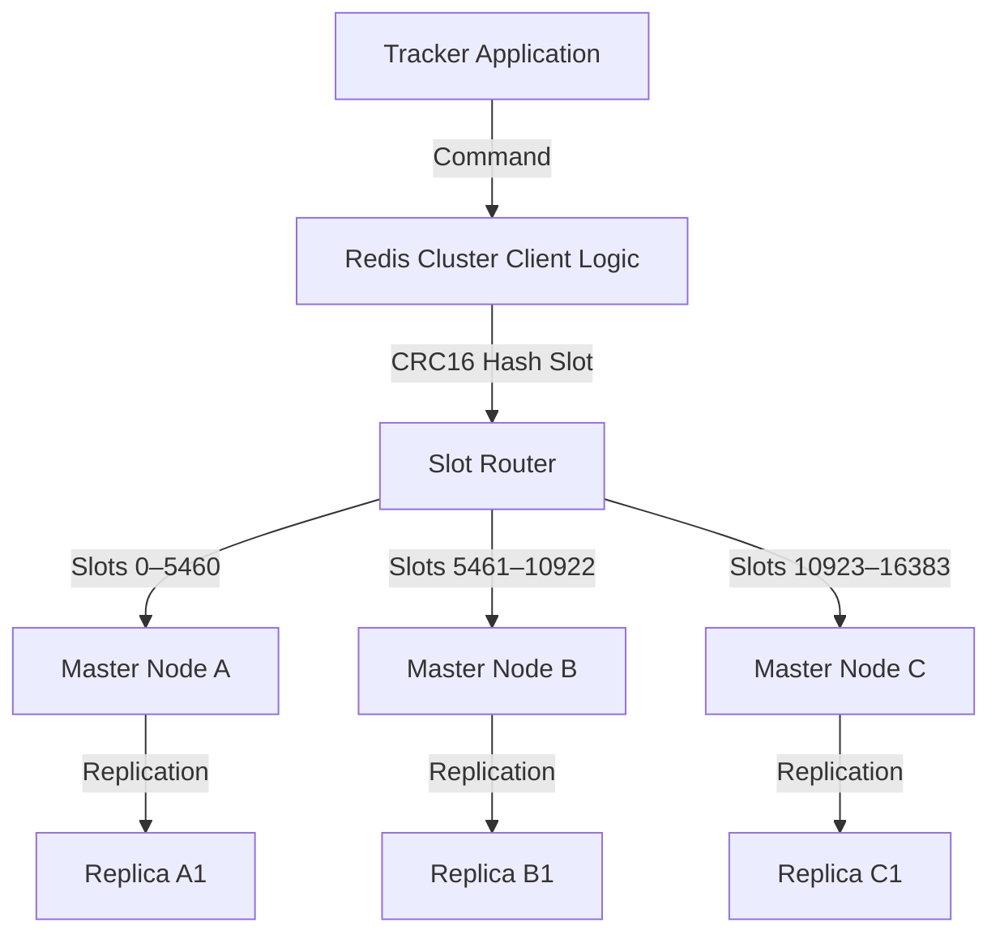
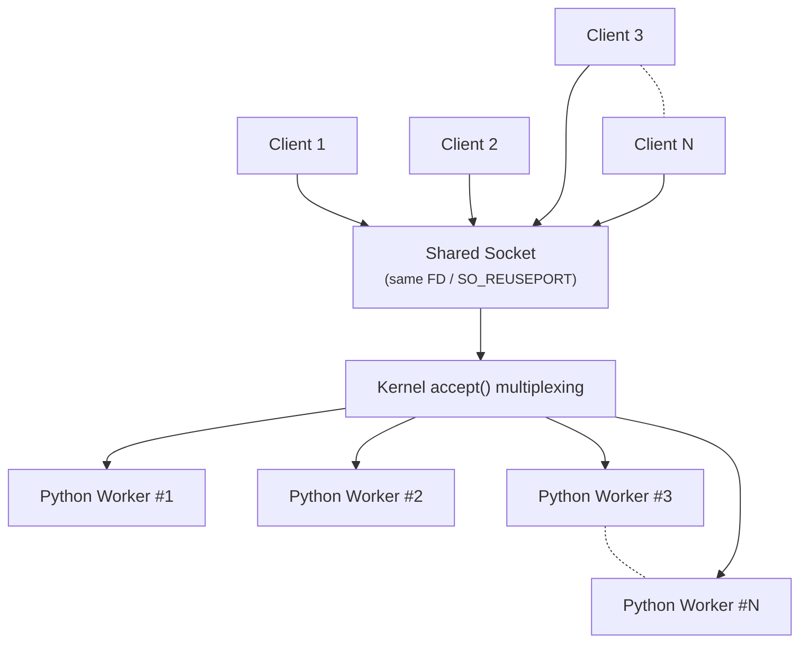

Since our [architecture](architecture.md#main-workflow) is distributed by nature, it scales [horizontally](https://en.wikipedia.org/wiki/Scalability#Horizontal_(scale_out)_and_vertical_scaling_(scale_up)).

We have to look out for 2 sections when scaling up:

* **Redis**: Our primary datasource for everything. We can scale redis via [clustering](https://redis.io/learn/operate/redis-at-scale/scalability/clustering-in-redis).

* **Python**: Our consumers are python based, which to scale we would have to scale the number of cores in a server.

## Redis

This is how redis cluster work (at a high level):

### HASH

Based on our [RedisDatastructure](https://github.com/coreproject-moe/coreproject/blob/25ffda9efa0b59bfc5065e16bde5f83569669501/tracker/backend/coreproject_tracker/datastructures/immutable/redis.py#L19-L51) the current (very rough) estimate of memory consumption (per-entry) is:

    <table>
        <thead>
            <tr>
                <th>Component</th>
                <th>Bytes</th>
            </tr>
        </thead>
        <tbody>
            <tr>
                <td>JSON value</td>
                <td>~156</td>
            </tr>
            <tr>
                <td>Field name</td>
                <td>~33</td>
            </tr>
            <tr>
                <td>Hash entry overhead</td>
                <td>~40</td>
            </tr>
            <tr>
                <td><strong>Total HASH</strong></td>
                <td><strong>~230 bytes</strong></td>
            </tr>
        </tbody>
    </table>

### ZSET

Based on a rough estimation:

    <table>
        <thead>
            <tr>
                <th>Component</th>
                <th>Bytes</th>
            </tr>
        </thead>
        <tbody>
            <tr>
                <td>Member string</td>
                <td>~33</td>
            </tr>
            <tr>
                <td>Score</td>
                <td>8</td>
            </tr>
            <tr>
                <td>ZSET overhead</td>
                <td>~72</td>
            </tr>
            <tr>
                <td><strong>Total ZSET</strong></td>
                <td><strong>~113 bytes</strong></td>
            </tr>
        </tbody>
    </table>

### Total Cost

Based on the [HASH](#hash) and [ZSET](#zset) value, the cost roughens to:

    <table>
        <thead>
            <tr>
                <th>Structure</th>
                <th>Bytes</th>
            </tr>
        </thead>
        <tbody>
            <tr>
                <td>HASH</td>
                <td>~230</td>
            </tr>
            <tr>
                <td>ZSET</td>
                <td>~113</td>
            </tr>
            <tr>
                <td><strong>TOTAL</strong></td>
                <td><strong>~340–360 bytes per peer</strong></td>
            </tr>
        </tbody>
    </table>

### At Scale

Based on [total cost estimation](#total-cost), this scales to

    <table>
        <thead>
            <tr>
                <th>Peers</th>
                <th>Memory</th>
            </tr>
        </thead>
        <tbody>
            <tr>
                <td>100K</td>
                <td>~40–45 MB</td>
            </tr>
            <tr>
                <td>1M</td>
                <td>~400–450 MB</td>
            </tr>
            <tr>
                <td>10M</td>
                <td>~4–4.5 GB</td>
            </tr>
        </tbody>
    </table>

## Python

Our python process[^1] [architecture](architecture.md) is entirely event driven:

Roughly this translates horizontal scaling.

[^1]: See the process [architecture](architecture.md#process-flowchart). Each process is based on a light task group, that effectively manages http/websocket and udp on one process. This results in very efficient distribution of task.